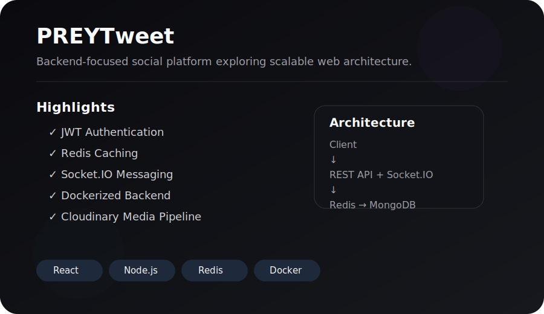
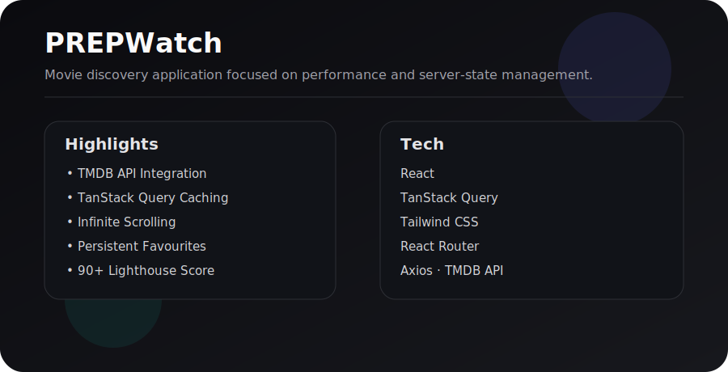

# Srijan Shukla

Backend Engineer • Full Stack Developer • CSE Undergraduate

---

# Featured Project

## PREYTweet

Backend-first social media platform built with production-oriented architecture.

### Highlights

- JWT Authentication
- Refresh Token Authentication
- Redis Caching
- Socket.IO Real-time Messaging
- Dockerized Backend
- Cloudinary Media Pipeline
- Aggregation Pipelines
- RESTful API Design

### Tech Stack

`Node.js` • `Express.js` • `MongoDB` • `Redis` • `Socket.IO` • `Docker` • `Cloudinary`

**Repository**

https://github.com/PREPMND/ytweet

---

# Project

## PREPWatch

Movie discovery platform built using modern React architecture.

### Features

- TMDB API Integration
- Infinite Scroll
- Search
- Favorites
- TanStack Query
- Responsive UI
- Lazy Loading
- Optimized API Fetching

### Tech Stack

`React` • `TanStack Query` • `Tailwind CSS` • `Axios`

Repository

https://github.com/PREPMND/PREPWatch

---
## Engineering Stack

### Languages

  
  
  

`C++` • `JavaScript` • `Python`

---

### Frontend

  
  
  

`React` • `Tailwind CSS` • `TanStack Query`

---

### Backend

  
  <<svg role="img" viewBox="0 0 24 24" xmlns="http://www.w3.org/2000/svg"><title>Express</title><path d="M12.262 16.666h1.146l6.975-9.325H19.22zm9.778 1.441v.004l-4.334-5.706-.557.74 4.873 6.682H.945V4.173h9.505l5.026 6.7.574-.772-4.374-5.928h.003l-.719-.945H0v17.544h24zM10.917 8.705a3.8 3.8 0 0 0-1.292-1.183q-.796-.45-1.916-.45c-.746 0-1.37.14-1.906.424a3.76 3.76 0 0 0-1.31 1.12 4.9 4.9 0 0 0-.75 1.581 7.17 7.17 0 0 0 0 3.696c.148.567.402 1.101.75 1.573a3.5 3.5 0 0 0 1.31 1.066q.803.39 1.906.389 1.77 0 2.739-.868.966-.867 1.328-2.457h-1.139q-.271 1.084-.977 1.734-.704.651-1.952.65-.812 0-1.392-.342a3.1 3.1 0 0 1-.957-.869 3.5 3.5 0 0 1-.551-1.182 5 5 0 0 1-.17-1.133 9 9 0 0 0-.015-.286 4.5 4.5 0 0 1 .015-.829c.047-.418.147-.83.296-1.223A3.7 3.7 0 0 1 5.54 9.05a2.9 2.9 0 0 1 .922-.742q.541-.28 1.246-.28c.47 0 .869.093 1.23.28q.541.281.922.742.379.461.587 1.057t.225 1.246H5.625l.004.957h6.182a7.3 7.3 0 0 0-.18-1.924 4.9 4.9 0 0 0-.715-1.68z"/></svg>
  <svg role="img" viewBox="0 0 24 24" xmlns="http://www.w3.org/2000/svg"><title>Socket.io</title><path d="M11.9362.0137a12.1694 12.1694 0 00-2.9748.378C4.2816 1.5547.5678 5.7944.0918 10.6012c-.59 4.5488 1.7079 9.2856 5.6437 11.6345 3.8608 2.4179 9.0926 2.3199 12.8734-.223 3.3969-2.206 5.5118-6.2277 5.3858-10.2845-.058-4.0159-2.31-7.9167-5.7588-9.9796C16.354.5876 14.1431.0047 11.9362.0137zm-.063 1.696c4.9448-.007 9.7886 3.8137 10.2815 8.9245.945 5.6597-3.7528 11.4125-9.4875 11.5795-5.4538.544-10.7245-4.0798-10.8795-9.5566-.407-4.4338 2.5159-8.8346 6.6977-10.2995a9.1126 9.1126 0 013.3878-.647zm5.0908 3.2248c-2.6869 2.0849-5.2598 4.3078-7.8886 6.4567 1.2029.017 2.4118.016 3.6208.01 1.41-2.165 2.8589-4.3008 4.2678-6.4667zm-5.6647 7.6536c-1.41 2.166-2.86 4.3088-4.2699 6.4737 2.693-2.0799 5.2548-4.3198 7.9017-6.4557a255.4132 255.4132 0 00-3.6318-.018z"/></svg>

`Node.js` • `Express.js` • `Socket.IO`

---

### Database

  
  
  

`MongoDB` • `Redis` • `Elasticsearch`

---

### Infrastructure

  
  
  
  

`Docker` • `Git` • `Cloudinary` • `Postman`
---

## Core Competencies

- Backend API Development
- Authentication & Authorization
- Database Modeling
- Real-time Systems
- Client-side Applications
- Performance Optimization
- RESTful Services
- Containerized Development

# Coding

- 180+ LeetCode Problems
- Primary Language: C++
- Backend Engineering
- System Design

---

# GitHub Analytics

---

## Connect

<a href="YOUR_LINKEDIN">LinkedIn</a> •
<a href="https://github.com/PREPMND">GitHub</a> •
<a href="YOUR_LEETCODE">LeetCode</a>

  

