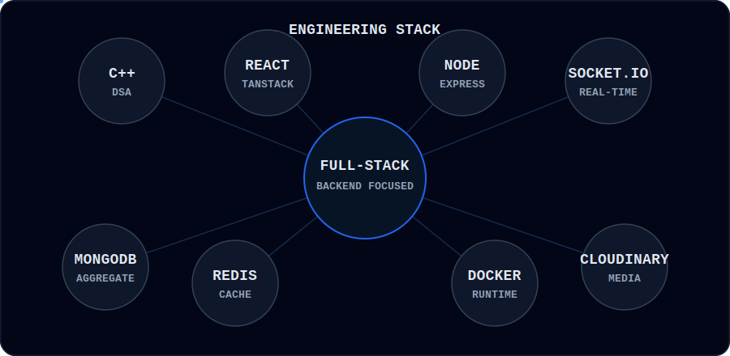

<div align="center">


<a href="https://git.io/typing-svg">

</a>

<br/><br/>

<a href="mailto:pretest0505@gmail.com">

</a>

<a href="https://github.com/PREPMND">

</a>

</div>

<br/>

## `> whoami`

```text
Srijan Shukla
B.Tech Computer Science
Maharaja Agrasen Institute of Technology
CGPA: 9.48 / 10
```

I build full-stack applications with a growing focus on **backend systems and application reliability**.

<div align="center">



</div>
## `> engineering_stack`

<div align="center">


<br/><br/>


<br/><br/>

<p align="center">


&nbsp;

&nbsp;


<br/><br/>


&nbsp;

&nbsp;


<br/><br/>


&nbsp;

&nbsp;


</p>
</div>

</div>
<br/>

---

## `> flagship_project`

<div align="center">

# PREYTweet

### Full-Stack Social Media Platform

`React` · `Node.js` · `Express` · `MongoDB` · `Redis` · `Socket.IO` · `Docker`

<br/>

**A backend-focused social platform engineered around secure APIs,  
real-time communication, caching, and reliable data flows.**

<br/>

<a href="https://preytweet.netlify.app">

</a>

<a href="https://github.com/PREPMND/ytweet">

</a>

</div>

<br/>

### `01 / SYSTEM DESIGN`

The application follows a **modular RESTful architecture**, separating routes, controllers, middleware, database models, and reusable API utilities.

```text
                         PREYTweet
                             │
              ┌──────────────┴──────────────┐
              │                             │
         REST API                      REAL-TIME
              │                             │
     Express + Middleware                 Socket.IO
              │                             │
    ┌─────────┼─────────┐          Conversation Rooms
    │         │         │                   │
   Auth     Redis    Rate Limit       Persistent Messages
    │         │         │                   │
    └─────────┴────┬────┘                   │
                   │                        │
                   └──────────┬─────────────┘
                              │
                           MongoDB
```

<br/>

### `02 / AUTHENTICATION`

```text
LOGIN
  │
  ├──► Access Token ─────► Protected API Requests
  │
  └──► Refresh Token ────► HTTP-only Cookie
                                  │
                                  ▼
                         Access Token Expired
                                  │
                                  ▼
                         Axios Interceptor
                                  │
                                  ▼
                         Refresh → Retry Request
```

- JWT-based access and refresh token authentication
- HTTP-only cookie storage for refresh tokens
- Middleware-driven protected routes
- Axios interceptor flow for expired authentication and failed-request retrying

<br/>

### `03 / REAL-TIME MESSAGING`

One-to-one messaging is built using **Socket.IO conversation rooms**.

```text
USER A ──────┐
             │
             ▼
      Participant Pair
             │
             ▼
    Conversation Identity
             │
             ▼
       Socket.IO Room
             │
       ┌─────┴─────┐
       ▼           ▼
    USER A       USER B
             │
             ▼
      MongoDB Persistence
```

Conversation identity is derived from the participant pair, allowing the same two users to resolve to a consistent conversation.

<br/>

### `04 / RELIABILITY & DATA`

| System | Engineering Role |
| :--- | :--- |
| **Redis** | Cache frequently requested application data |
| **Rate Limiting** | Control repeated API traffic |
| **MongoDB Aggregation** | Build channel profiles, subscriptions, and watch history |
| **Pagination** | Incrementally retrieve video data |
| **TanStack Query** | Cache and synchronize client-side server state |

<br/>

### `05 / MEDIA PIPELINE`

```text
CLIENT
  │
  ▼
Multer
  │
  ├──► Avatar
  ├──► Cover Image
  ├──► Video
  └──► Thumbnail
          │
          ▼
      Cloudinary
          │
          ▼
    MongoDB Metadata
```

Built media pipelines for user and video assets using **Multer and Cloudinary**.

<br/>

### `06 / INFRASTRUCTURE`

Backend services are containerized using **Docker** to standardize runtime environments and application dependencies.

```text
┌─────────────────────────────────────────┐
│             Docker Environment          │
│                                         │
│     Node / Express        Redis          │
│           │                 │            │
│           └────────┬────────┘            │
│                    │                     │
│                 MongoDB                  │
│                                         │
└─────────────────────────────────────────┘
```

<br/>

<div align="center">

### From REST APIs to real-time systems.

**PREYTweet is where I'm learning to think beyond features and reason about  
data flow, failure cases, state, and backend reliability.**

<br/>

<a href="https://preytweet.netlify.app">

</a>

<a href="https://github.com/PREPMND/ytweet">

</a>

</div>

<br/>

---

## `> another_build`

### PREPWatch — Movie Discovery Application

`React` · `TanStack Query` · `TMDB API` · `Tailwind CSS`

A responsive movie discovery application focused on **server-state management and efficient API consumption**.

- Integrated the TMDB REST API for movie and cast data
- Used TanStack Query for caching and background refetching
- Built movie search and persistent favourites
- Implemented dynamic routing, trailers, and cast discovery
- Structured reusable React components
- Achieved a **90+ Lighthouse performance score**

<div align="center">

<a href="https://prepwatch.netlify.app">

</a>

<a href="https://github.com/PREPMND/pretanstack">

</a>

</div>

<br/>

---

## `> problem_solving`

```cpp
struct CurrentProgress {
    std::string language = "C++";
    int leetcodeProblems = 180;

    std::vector<std::string> covered = {
        "Arrays",
        "Binary Search",
        "Recursion",
        "Stacks",
        "Queues",
        "Hashing"
    };

    std::string next = "Trees -> Graphs -> Dynamic Programming";
};
```

<div align="center">

### 180+ LeetCode problems solved in C++

`DSA` · `Complexity Analysis` · `Problem Solving`

</div>

<br/>

---

## `> current_focus`

```text
01. Deepening DSA and competitive programming
02. Building more reliable backend systems
03. Understanding caching beyond "just add Redis"
04. Designing APIs around failure cases and scale
05. Learning by shipping systems that force me to debug real problems
```

<br/>

<div align="center">


<br/><br/>

<sub>
I like projects that eventually make me ask:
<br/>
<b>"okay, but what happens when this fails?"</b>
</sub>

<br/><br/>


</div>
